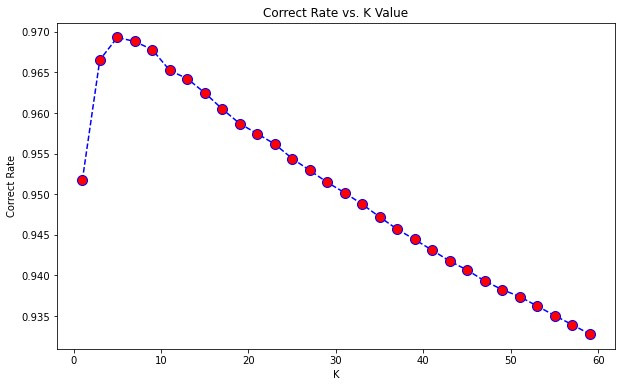

可能會有中英交雜的情況，我覺得用英文打比較方便，但為了求快時就會用中文了。  
Main.py是訓練KNN, Decision Tree, Random Forest: Main2.py是訓練XGBoost, Random Forest, SVR  

# Data source
[Bike Sharing Demand - Kaggle](https://www.kaggle.com/competitions/bike-sharing-demand/overview)  
Downing the *.csv, and put them in data folder.

# KNN
`numpy.mean`: Must use `np.array`. Cause `array` not work to judge True or False.  
I used two method: `GridSearchCV` and `numpy.mean` to find k. GridSearchCV was successful, but numpy.mean wasn't.
Then, I though why not use `knn.score` to find the best corret rate.
Ha! Finally, two method found the same k.  
I found that the Method 1 only using train data, not using validation data. So, using Method 2 will be better. But, these two are almost same.  
在KNN中，我想要用物件導向。但是一直跳出`unhashable type: 'numpy.ndarray'`的錯誤，可以參考 [Python初學者之TypeError: unhashable type: 'list'問題分析](https://www.796t.com/content/1548405036.html)
大意上就是list或array不存在hash，無法用hash做為索引，必須要用`tuple()`，才有可能做物件導向。需要再研究吧，目前先用`Main.py`將就一下。
## 找到最佳k值

 

### References
[機器學習 第5篇：knn迴歸 - iT人](https://iter01.com/549663.html)  
[Python機器學習筆記(五)：使用Scikit-Learn進行K-Nearest演算法](https://yanwei-liu.medium.com/python機器學習筆記-五-使用scikit-learn進行k-nearest演算法-1191ea94ecaf)  
[調參——得到更好的 kNN 模型](https://www.gushiciku.cn/pl/2DZ0/zh-tw)

# Decision Tree
我沒想到連這個Decision tree居然特別設置針對回歸分析的，不得不說sklearn模組做得真的很好。  
### References
[資料視覺化之 Decision tree (決策樹)範例與 Machine Learning (機器學習) 概念簡單教學(入門)](https://tree.rocks/decision-tree-graphviz-contour-with-pandas-gen-train-test-dataset-for-beginner-9137b7c8416a)  

# Random Forest
### References
[[Python實作] 隨機森林模型 Random Forest](https://pyecontech.com/2019/11/03/python_random_forest/)  

# XGBoost
### References
[[Day 15] 機器學習常勝軍-XGBoost -iT人](https://ithelp.ithome.com.tw/articles/10273094)  
[Using XGBoost with Scikit-learn -kaggle](https://www.kaggle.com/code/stuarthallows/using-xgboost-with-scikit-learn/notebook)  
[Scikit-Learn API -XGBoost](https://xgboost.readthedocs.io/en/stable/python/python_api.html#module-xgboost.sklearn)  

